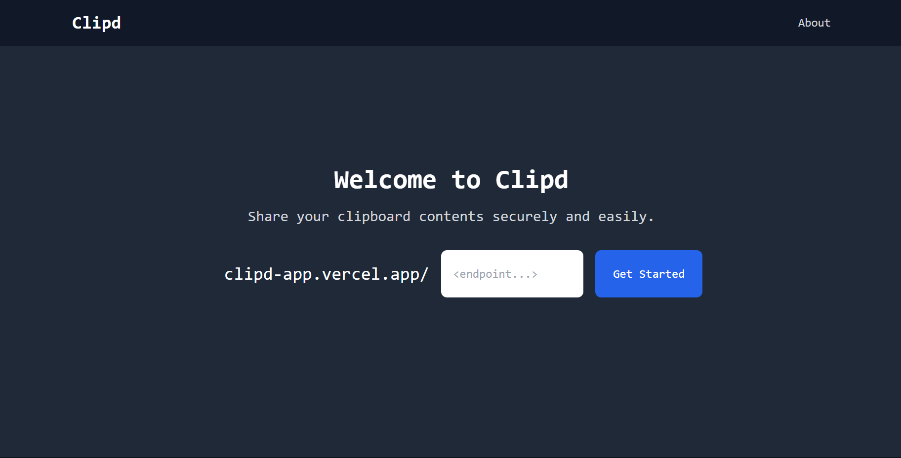

# Clipd

Clipd is a minimalist clipboard application that enables users to save text effortlessly, generate customizable links for easy access, and retrieve or update content at any time. It's ideal for quick notes, code snippets, or shared ideas.

## Features

- **Easy Text Saving**: Quickly save any text input for future reference.
- **Customizable Links**: Generate personalized links to access your saved content.
- **Content Management**: Retrieve, update, or delete your saved content as needed.

## Usage

1. **Save Text**: Enter your text into the input field and save it.
2. **Generate Link**: Create a customizable link to access your saved content by visiting `https://clipd-app.vercel.app/<your-link>`.
3. **Access Content**: Use the generated link to view or edit your content at any time.

## Benefits

- **Simplicity**: User-friendly interface for seamless text management.
- **Accessibility**: Access your saved content from any device via customizable links while ensuring lossless retrieval of data.
- **Flexibility**: Easily update or delete content as your needs change.

## Areas for Improvement

- **Enhanced Security**: Adding encryption to protect sensitive information.
- **Rich Text Support**: Allowing formatting options for saved content.
- **Support for media/documents**: Including support for storage and retrieval of image, audio, video or PDF files.

## Tech Stack

- **Frontend**: HTML, CSS, JavaScript
- **Backend**: Python with FastAPI
- **Database**: PostgreSQL (managed through Supabase)
- **Deployment**: Hosted on Vercel

## Contributing

I welcome contributions from the community! To get started:

1. **Fork the Repository**: Create a personal copy of the repository.
2. **Clone the Repository**: Download your fork to your local machine.
3. **Create a New Branch**: Work on your feature or bug fix in a separate branch.
4. **Submit a Pull Request**: Propose your changes for review.

## License

This project is licensed under the MIT License. See the [LICENSE](LICENSE) file for details.

## Contact

For questions or suggestions, please open an issue or contact the project maintainer at [https://sarbosarcar.github.io/](https://sarbosarcar.github.io/)
